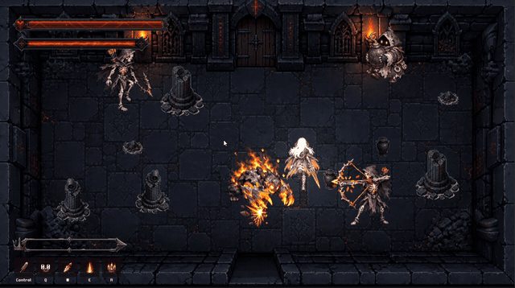
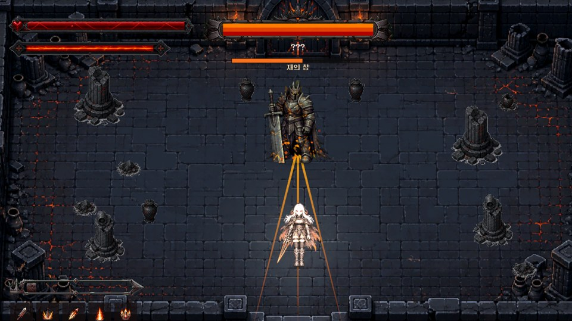
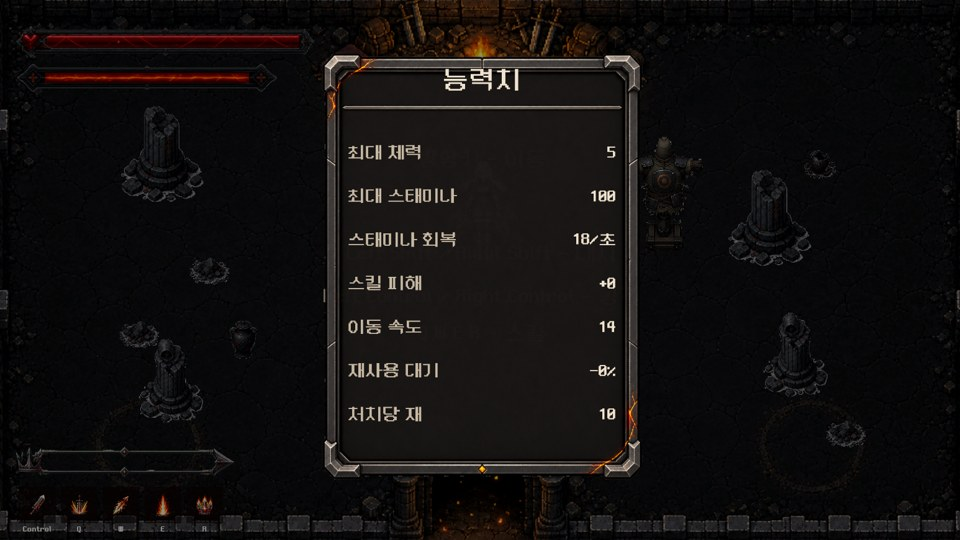

# 재의 길 (Path of Ash)

> 타고 남은 것은 길뿐이다.

**▶ [itch.io에서 받기 (Windows · 무료)](https://gaksultang.itch.io/path-of-ash)** · **▶ [트레일러 40초](https://youtu.be/eM5TvuQwl2s)**

| | |
| --- | --- |
| 장르 | 2D 탑다운 픽셀아트 던전 로그라이크 · 한 판 약 30분 |
| 엔진 | Unity 6 (6000.3) · URP 2D · C# · Input System · Timeline |
| 개발 | **1인 개발** — 기획, 프로그래밍, 연출, 에디터 도구, 빌드·배포 |
| AI 활용 | 그림 일부와 코드 작성에 생성형 AI(GPT, Claude)를 썼고, 설계 판단·통합·검증은 직접 했습니다 |
| 버전 | 1.0.0 — 2026-10-06 itch.io 공개 |

  
  

`재의 길`은 영구 성장 없이 한 판의 아이템 시너지와 전투 숙련으로 진행하는 2D 탑다운 던전 슬래셔 로그라이크입니다.

## 핵심 방향

- 죽으면 언락과 영구 강화 없이 처음부터 다시 시작합니다.
- 반복 동기는 유물 조합과 짧고 명확한 전투 판단에서 만듭니다.
- 잿빛·숯색을 기본으로 사용하고 주황색 잉걸만 강조색으로 씁니다.
- 픽셀아트는 작은 화면에서도 실루엣과 공격 예비동작이 먼저 읽혀야 합니다.

## 현재 구현 상태

- 타이틀 → 게임 → 결과 → 재시작 런 흐름
- 튜토리얼 방 → 던전 방 반복 → 보스 방 → 결과 진행
- 플레이어 **8방향** 이동·공격·스킬 (클립 80개를 블렌드 트리로 처리)
- 공용 체력·피격·넉백 시스템 (`EnemyBase`가 탐지·넉백·사망·풀 복귀를 소유)
- **적 3종** — 잿불 망령(옆으로 피함), 잿불 사수(다가가서 피함), 잿불 자폭병(멀어져서 피함)
- 방마다 적 구성을 가중치로 다시 뽑고 순서를 섞음 — 같은 방도 매번 다르게 나옴
- 방 전멸 → 보상 상자 → 문 개방 → 다음 방 진행
- 유물 14종, 보관함과 장착 슬롯 3개, 장착 유물만 능력치 적용
- 보스 열쇠 4종과 전용 칸 4개, 다 모으면 부서진 문이 열려 보스 방으로 이어짐
- 재의 왕 2페이즈 보스 — 내려찍기·잿불 파도·재 폭발 세 패턴과 체력 **70%** 페이즈 전환.
  두 페이즈의 몫을 일부러 어긋나게 나눴습니다 — 1페이즈가 전체의 30%, 2페이즈가 70%입니다.
  반반이면 2페이즈가 "체력이 한 번 더 있는 1페이즈"가 되는데, 실제로 어려운 쪽은 뒤입니다
- 2페이즈 전환은 **Timeline 3.125초 연출**입니다. 갑옷 붕괴 → 재 파티클 → 알 응축 →
  껍질 깨짐 → 2페이즈 등장. 연출 길이의 주인이 타임라인 에셋 하나뿐이라
  코드와 클립의 시간이 갈라질 자리가 없습니다
- 보스 체력바 HUD — **페이즈마다 바를 새로 씁니다.** 전환 직전에 바가 완전히 비고,
  전환이 끝나면 다시 가득 찹니다. **이름도 `???`로 감췄다가 그때 드러납니다**
- **보스 처치 → 클리어 유물 획득 → 문 통과 시 승리** (이 게임의 유일한 승리 조건)
- URP 2D 조명과 캐릭터 접지 그림자, Y축 정렬 기반 앞뒤 표현
- 체력·스태미나·스킬·유물 인벤토리 UI
- 설정 화면(일반/조작)과 **키 리바인딩** — 모든 조작 액션을 `InputBindings` 하나가 소유하고,
  스킬바·튜토리얼·결과 화면 문구가 실제 바인딩에서 키를 읽습니다

- **소리** — 효과음은 그림·판정과 같은 순간에 납니다(보스 내려찍기는 예비동작이 아니라 칼이 닿을 때).
  적·보스 사망 소리는 적마다 넣지 않고 `Health`의 사망 알림 한 곳에서 고르고,
  보스 2페이즈 전환 소리는 Timeline 시그널에 붙어 있어 연출 시간표를 고치면 소리도 따라갑니다.
  방마다 배경음악이 바뀌고, 결과 화면은 클리어/사망에 따라 다른 곡이 나옵니다
- 궁극기 컷인 동안에는 게임 시간과 배경음악이 **같은 자리에서 멈췄다가 멈춘 지점부터 이어집니다**
  (`PauseGate` 옆에서 `AudioSource.Pause/UnPause`)

세부 구현 상태와 다음 작업은 [프로젝트 컨텍스트](Docs/PROJECT_CONTEXT.md)를 기준으로 확인합니다.

## 조작

- 이동: 방향키
- 대시: `Shift`
- 기본 공격: `Ctrl`
- 스킬: `Q`, `W`, `E`, `R`
- 상호작용: `F`
- 인벤토리: `I` 또는 `Tab`
- 보스 열쇠: `T` (인벤토리와 서로 전환됩니다)
- 설정: `ESC` (타이틀에서는 종료입니다)

키는 설정 화면의 조작 탭에서 바꿀 수 있습니다. `ESC`만 고정입니다 — 화면을 빠져나오는 키를
옮길 수 있게 하면 창에서 못 나오는 상태를 스스로 만들 수 있습니다.

## 개발 환경

- Unity `6000.3.14f1`
- Universal Render Pipeline 2D Renderer
- New Input System
- 기준 해상도 `640×360`
- 캐릭터 기준 PPU `32`

## 주요 구조

- `Assets/Project/Scripts/Core` — 런 수명과 씬 흐름
- `Assets/Project/Scripts/Combat` — 체력, 피해, 히트박스
- `Assets/Project/Scripts/Skills` — ScriptableObject 기반 스킬
- `Assets/Project/Scripts/Dungeon` — 방 진행과 출구
- `Assets/Project/Scripts/Items` — 유물 데이터, 인스턴스, 인벤토리
- `Assets/Project/Scripts/Enemy` — 일반 적과 보스 상태 머신
- `Assets/Project/Scripts/UI` — HUD와 인벤토리 화면
- `Assets/Editor` — 임포트, 빌더, 슬라이스 자동화 도구
- `Tools` — 스프라이트 시트 정규화·설치 PowerShell 도구

방 진행은 전투(`RoomEncounter`)와 보상(`RoomReward`) 두 축으로만 추상화되어 있습니다.
`RoomController`는 "전투가 끝나면 보상, 보상을 챙기면 문"만 알고, 그것이 잡몹 떼인지
보스인지·상자인지 유물인지는 모릅니다. 덕분에 보스 방과 튜토리얼 방을 추가하면서
방 진행 로직은 수정하지 않았습니다.

## 문서

- [PROJECT_CONTEXT.md](Docs/PROJECT_CONTEXT.md) — 현재 상태, 중요한 규칙, 다음 작업을 빠르게 파악하는 문서
- [DEVELOPMENT_LOG.md](Docs/DEVELOPMENT_LOG.md) — 날짜별 작업 과정과 설계 근거 전체 기록
- [PORTFOLIO.md](Docs/PORTFOLIO.md) — 포트폴리오 전체 구성과 마감 작업 순서
- [RELEASE.md](Docs/RELEASE.md) — 빌드·itch.io 배포·PV 영상 순서와 정해 둔 값

## 크레딧 — 소리

모든 음원은 **CC0(퍼블릭 도메인)** 입니다. 출처 표기 의무는 없지만 감사의 뜻으로 적습니다.
각 폴더의 `SOURCE.txt`에 받은 날짜와 원본 주소가 있습니다.

| 쓰는 곳 | 곡·팩 | 제작자 |
| --- | --- | --- |
| 타이틀 | [Dark Shrine Loop](https://opengameart.org/content/dark-shrine-loop) | qubodup (remix of Shrine by yd) |
| 튜토리얼 | [Save sound (suspense)](https://opengameart.org/content/save-sound-suspense) | allen yatsura |
| 던전 | [Dark Place (loop)](https://opengameart.org/content/dark-place-loop) | SkyleTheFrench |
| 보스전 | Heavy Dungeon | MintoDog |
| 결과(클리어) | [Cathedral in the forest](https://opengameart.org/content/cathedral-in-the-forest-ambient-loop) | congusbongus |
| 결과(사망) | [Vampire's Piano](https://opengameart.org/content/vampires-piano) | TAD |
| 스킬 | [Basic Spell Impacts](https://lentikula.itch.io/freecc0-basic-spell-impacts-sfx), [Druid Spell Impacts](https://lentikula.itch.io/druid-spell-impacts) | lentikula |
| 문·보스·폭발 | [100 CC0 SFX](https://opengameart.org/content/100-cc0-sfx) | rubberduck |
| 보스 전환 | [Impact Sounds](https://kenney.nl/assets/impact-sounds) | Kenney |
| 적 공격 | [Swishes Sound Pack](https://opengameart.org/content/swishes-sound-pack) | OpenGameArt |
| 적 사망·보스 등장 | [Ghost](https://opengameart.org/content/ghost), [Ghost breath](https://opengameart.org/content/ghost-breath) | OpenGameArt |

공격·피격·상자·발소리·대시는 [Minifantasy Dungeon SFX](https://leohpaz.itch.io/minifantasy-dungeon-sfx-pack)(Leohpaz)를 씁니다.
CC0가 아니고 팩 재배포가 금지라 **저장소에는 없고 빌드에만 들어갑니다.**

README에는 프로젝트 소개와 현재 기능만 유지합니다. 긴 문제 해결 과정과 날짜별 기록은 개발 로그에 추가하고, 현재 사실이 바뀌면 프로젝트 컨텍스트를 갱신합니다.
